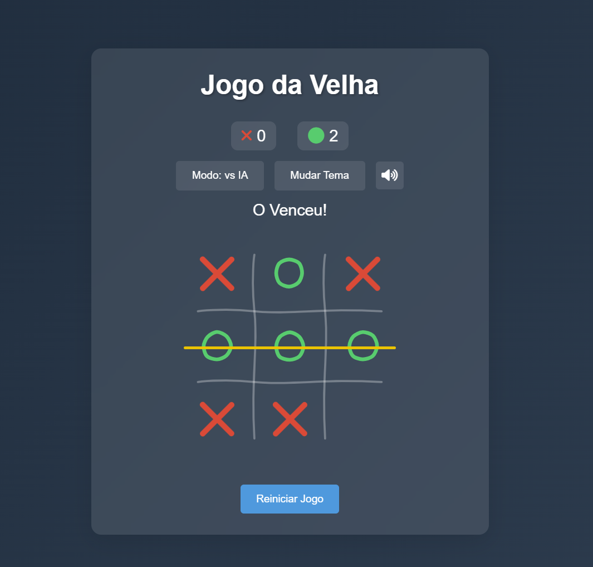

# Tic Tac Toe AI Edition

A beautiful and modern Tic Tac Toe game created with the assistance of AI. This project showcases the perfect blend of classic gameplay with modern web technologies and sleek animations.

[Play the game here!](https://olavogiamp.github.io/velha/)

## Features

- 🎮 Two game modes:
  - Player vs Player
  - Player vs AI (unbeatable minimax algorithm)
- 🎨 Multiple themes (Dark, Light, and Neon)
- 🎵 Sound effects with toggle option
- ✨ Handwritten-style animations for X's and O's
- 🎉 Victory celebration with particle effects
- 📱 Fully responsive design (works on all devices)
- 💯 Score tracking system
- 🎯 Smart AI opponent
- 🖌️ Smooth animations and transitions

## Technologies Used

- HTML5
- CSS3 (with modern features like CSS Variables and Flexbox)
- JavaScript (ES6+)
- SVG Animations
- Particles.js for effects
- Font Awesome for icons

## Technical Highlights

- Minimax algorithm for unbeatable AI
- SVG path animations for realistic drawing effects
- Responsive design with mobile-first approach
- Modern CSS animations and transitions
- Sound management system with preloading
- Touch events handling for mobile devices

## Getting Started

1. Clone the repository
2. Open `index.html` in your browser
3. Start playing!

No additional setup or dependencies needed - it's that simple!

## How to Play

1. Choose your game mode (2 Players or vs AI)
2. Players take turns placing their marks (X or O)
3. First player to align 3 marks horizontally, vertically, or diagonally wins
4. Use the restart button to start a new game at any time

## Customization

Feel free to:
- Modify themes in the CSS variables
- Add new sound effects
- Create new animations
- Implement new features

## License

This project is open source and available under the MIT License. Feel free to use it however you want!

## Created with AI

This project was created with the assistance of AI, demonstrating the potential of human-AI collaboration in creating engaging and functional web applications.

## Contributing

Feel free to fork, open issues, and submit PRs. All contributions are welcome!

---

Developed with ❤️ and AI 🤖
